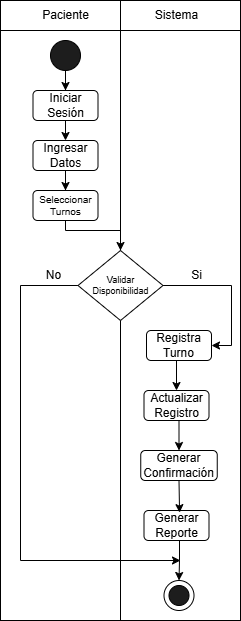
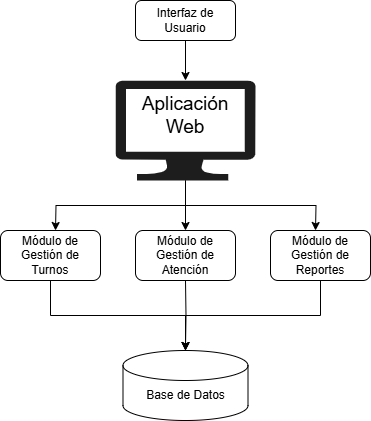
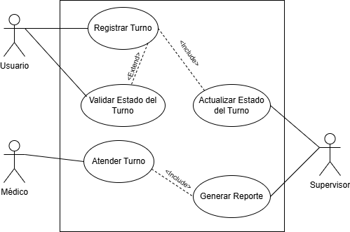
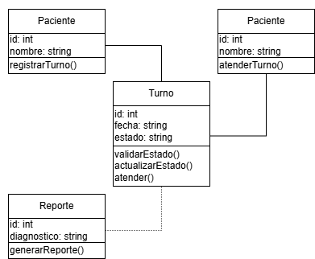
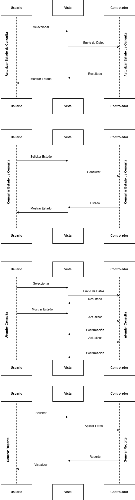
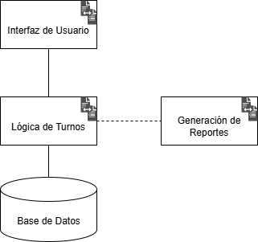
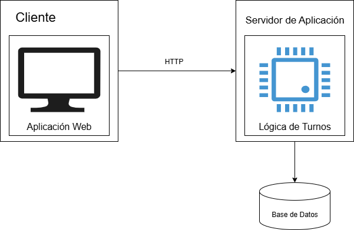
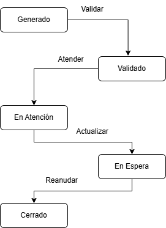
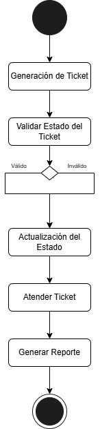

# Sistema de Gestión de Turnos para Centros Médicos

## Integrantes
- **Matías Villacís**  
- **Michael Palacios**  
- **Pablo Solís**  
- **Ricardo López**  

---

## Problema
Los centros médicos pequeños y medianos suelen gestionar turnos de forma manual o telefónica, lo que genera:
- Largas filas y tiempos de espera.  
- Confusión en el orden de atención.  
- Mala experiencia para pacientes.  
- Ineficiencia administrativa.  

## Objetivo
Desarrollar una **aplicación web** que permita:
- Agendar turnos en línea.  
- Gestionar estados: *Pendiente, En atención, Atendido, Cancelado*.  
- Generar reportes de productividad.  

---

## Diagramas del Sistema

### 1. Diagrama de Procesos
  
*Flujo: Usuario → Sistema de turnos → Supervisor.*

### 2. Arquitectura del Sistema
  
*Componentes y capas del sistema.*

### 3. Diagrama de Casos de Uso
  

#### Casos de Uso Detallados:
| **Código** | **Nombre**               | **Actor**       | **Descripción**                                                                 |
|------------|--------------------------|-----------------|---------------------------------------------------------------------------------|
| CU-01      | Registrar Turno          | Paciente        | Selecciona servicio y fecha/hora. Sistema valida disponibilidad.                |
| CU-02      | Validar Estado           | Sistema → Médico| Verifica estado del turno para atender/cancelar.                                |
| CU-03      | Actualizar Estado        | Médico          | Cambia estado (ej: "Atendido").                                                |
| CU-04      | Atender Turno            | Médico          | Gestiona consulta y genera registro.                                           |
| CU-05      | Generar Reporte          | Supervisor      | Obtiene reporte post-atención.                                                 |

### 4. Diagrama de Clases
  
*Clases principales: `Usuario`, `Turno`, `Médico`, `Reporte`.*

### 5. Diagrama de Secuencia
  
*Interacción entre Usuario, Aplicación y Base de Datos.*

### 6. Diagrama de Componentes
  
*Módulos: App Web, Gestión de Turnos, Base de Datos.*

### 7. Diagrama de Despliegue
  
*Nodos: Cliente, Servidor, Base de Datos.*

### 8. Diagrama de Estados
  
*Estados: `Generado` → `En atención` → `Atendido`/`Cancelado`.*

### 9. Diagrama de Actividades
  
*Flujo completo del ciclo del turno.*

### 10. Propuesta en Figma

#### Bocetos iniciales:
1. **Pantalla de inicio**:
   - Selector de roles
   - Menú principal

2. **Agendamiento**:
   - Calendario interactivo
   - Selector de especialidades

3. **Panel médico**:
   - Listado de turnos por estado
   - Botones de acción rápida

#### Elementos clave:
- **Paleta de colores**: Azul médico (#2A7F84) como primario
- **Tipografía**: Montserrat para legibilidad
- **Flujo**: [Ver prototipo](https://figma.com/ejemplo)

### 11. Página Web – Centro Médico Solís

#### Requisitos:
- XAMPP (Apache + MySQL + PHP)
- Navegador web moderno

#### Instalación:
1. **Configurar XAMPP**:
   - Iniciar servicios Apache y MySQL
   - Solucionar conflictos de puertos (terminar proceso "mysql" si es necesario)

2. **Base de datos**:
   - Crear BD: `proyectops`
   - Importar archivo SQL via phpMyAdmin (`http://localhost/phpmyadmin`)

3. **Despliegue**:
   - Copiar carpeta del proyecto a: `C:\xampp\htdocs\`
   - Acceder via: `http://localhost/copia/iniciarsesion.html`

#### Pantallas principales:
| Nombre           | Función                                  |
|------------------|------------------------------------------|
| Inicio           | Página principal con botones de acceso   |
| Inicio de Sesión | Autenticación por rol (Paciente/Médico/Admin) |
| Gestión Doctores | Administración de especialistas          |

---

